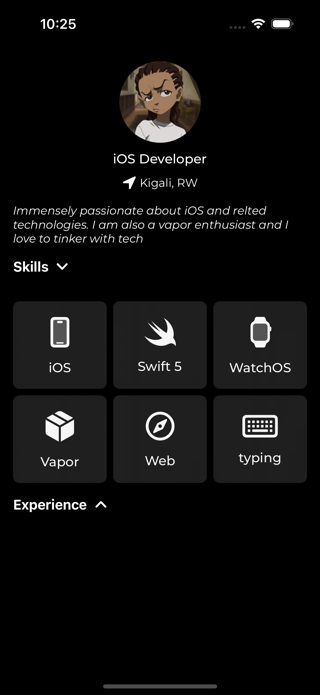

## PORTIFOLIO APP

> This Repo is created to demo component reusability for a friend.
> More changes can be applied to make it more cool

### Description

This App was created in SwiftUI to demo some useful functionalities of reusable components

More updates will be added to the project with time

### Features

Things to lookout for in the Project

## Screenshots

| **Screenshot** | **VIDEO** |
| -------------- | --------- |
|  | <video src="https://github.com/nshutinicolas/portifolio-app/assets/50362644/5ba1de59-8413-4c59-9671-879b25b4883a" width="300" />|

